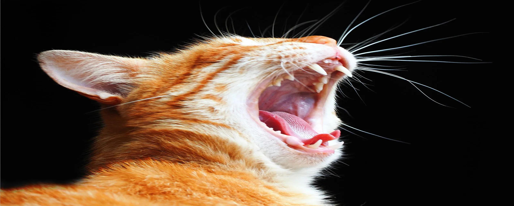

# Image Stretcher

This Python script resizes images while maintaining a desired aspect ratio. It allows for both horizontal and vertical stretching.

## Prerequisite

-   Python 3
-   Pillow (PIL) imaging library:  
    Install using `pip install Pillow`

## Usage

1. **Place the script in the same directory as your target image(s).**

2. **Execute the script from your terminal:**

    ```bash
    python main.py
    ```

3. **Follow the prompts:**
    - Enter the full image path (e.g., "cat-pre.png").
    - Select the stretch type:
        - '1' or 'horizontal' for horizontal
        - '2' or 'vertical' for vertical
    - Enter the desired aspect ratio (e.g., "16:9").

## Output

-   A new image file named "stretched_image.png" (or other appropriate extension) will be created in the same directory.

## Example

**Before:**

-   cat-pre.png (Original image)


[Image of cat-pre.jpg]

**Command:**

```
python stretch_image.py
Enter the image path: cat-pre.jpg
Enter the stretch type (horizontal(1) or vertical(2)): 1
Enter the aspect ratio (for example, 4:3 or 16:9): 16:9
```

**After:**

-   stretched_image.png (Image stretched horizontally to a 16:9 aspect ratio)



[Image of stretched_image.png]

**Notes**

-   The script supports common image formats (JPEG, PNG, etc.).
-   Invalid input will raise appropriate error messages.
